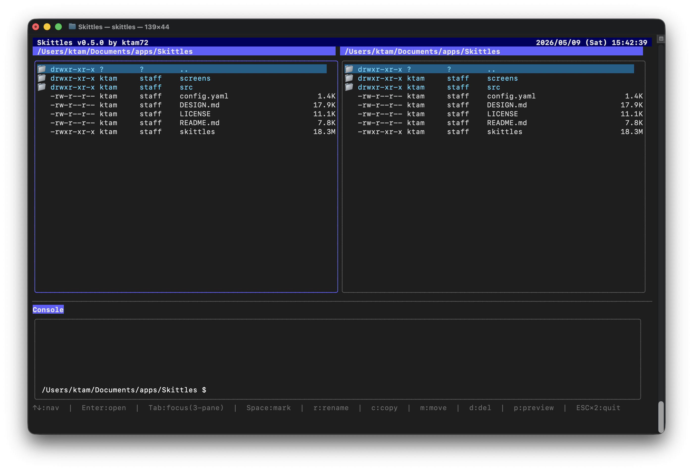
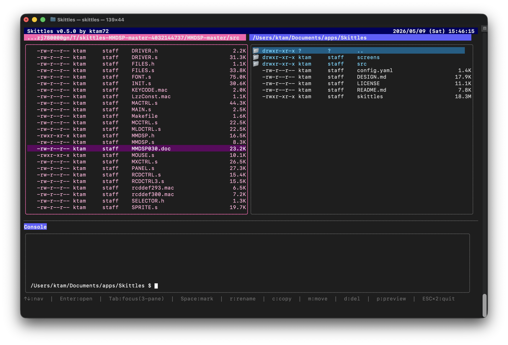
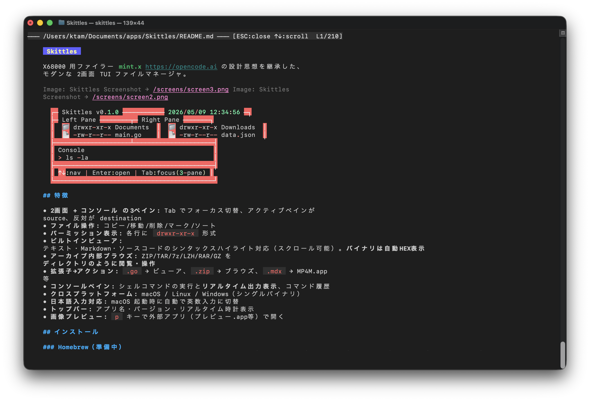

# Skittles

Dual-pane file manager with a terminal window.

2画面ファイラーにターミナル画面をくっつけたツールです。

その昔のX68000 用ファイラー mint.x の設計思想をヒントに作りました。

Pure Goで作成しているので、LinuxやWindowsのGo環境下でも動く可能性があります（未検証）

opencode with DeepSeekV4 で設計、開発、検証を行いました。

golangci-lintで検出した問題を潰してあります。





## 特徴

- **2画面 + コンソール の3ペイン**: Tab でフォーカス切替、アクティブペインが source、反対が destination
- **ファイル操作**: コピー/移動/削除（確認ダイアログ）/マーク/ソート/リネーム
- **パーミッション・所有者・グループ表示**: 各行に `drwxr-xr-x owner group` 形式
- **ビルトインビューア**: テキスト・Markdown・ソースコードのシンタックスハイライト対応（スクロール可能）。**バイナリは自動HEX表示**
- **文字コード自動判別**: UTF-8 / Shift-JIS / EUC-JP を自動検出して表示
- **アーカイブ内部ブラウズ**: ZIP/TAR/7z/GZ/BZ2 を **pure Goで内部展開**、ディレクトリのように閲覧・操作
- **拡張子→アクション**: `.go` → ビューア、`.zip` → ブラウズ、`.mdx` → MP4M.app 等
- **コンソールペイン**: **cd対応・`$`プロンプト表示**、コマンドの**リアルタイム出力**、履歴、スクロールバー
- **Pure Go**: CGo不要。Goの動作する環境であればどのプラットフォームでも動作するはず（macOSで開発・動作確認、Linux/Windowsは未確認）
- **日本語入力対応**: macOS 起動時・コンソールフォーカス時に自動で英数入力に切替
- **トップバー**: アプリ名・バージョン・クレジット・リアルタイム時計（曜日付き）表示
- **外部プレビュー**: `p` キーで外部アプリ（プレビュー.app等）で開く

## インストール

### Go

```bash
go install github.com/ktam72/skittles/v2@v2.6.0
```

#### アンインストール

```bash
rm -f $(go env GOPATH)/bin/skittles
```

### 手動ビルド

```bash
git clone git@github.com:ktam72/skittles.git
cd skittles

# ビルド（CGo不要）
go build -o skittles ./src

# 実行
./skittles
```

設定はプロジェクトルートの `config.yaml` を編集してください。

#### アーカイブ形式対応

| 形式 | エンジン |
|------|---------|
| ZIP | Go標準 `archive/zip` |
| TAR/TGZ | Go標準 `archive/tar` + `compress/gzip` |
| BZ2/TBZ2 | Go標準 `compress/bzip2` |
| 7z | `github.com/bodgit/sevenzip`（pure Go） |

全て pure Go。CGo不要。外部コマンド依存ゼロ。

## 使い方

```bash
# カレントディレクトリで起動
./skittles

# 左右別のディレクトリで起動
./skittles /usr/local /usr/local

# 同じディレクトリで起動
./skittles ~/Documents
```

### 基本操作

**3ペイン構成**: 左ペイン・右ペイン・コンソールペイン。Tab でフォーカスを切り替えます。
アクティブなペインが **source**、反対のファイルペインが **destination** として機能します。

#### ファイルの選択と操作

```
Space → カーソル行をマーク（複数選択）
    a → 全ファイルをマーク
    c → マークしたファイルを反対ペインへコピー
    m → マークしたファイルを反対ペインへ移動
    d → 削除（確認ダイアログ表示）
    r → ファイル名リネーム
```

マークがない場合、コピー/移動/削除はカーソル上の1ファイルのみが対象になります。

#### アーカイブ（ZIP/TAR/7z等）の操作

```
  Enter → アーカイブ内部をブラウズ（ディレクトリのように表示）
.. / ← / Backspace → アーカイブルートでは元のディレクトリに戻る
                      （サブフォルダ内では親フォルダへ）
    x → アーカイブをカレントディレクトリに展開
（アーカイブブラウズ中は枠・文字色がピンク色に変化します）
```

アーカイブ内部では通常のファイル操作（コピー・移動・削除）がそのまま使えます。
アーカイブから戻ると、元のアーカイブファイルにカーソルが復帰します。

#### コンソールペイン

```
  ! → コンソールにフォーカス移動
       cd コマンドが使えます（コンソール専用のカレントディレクトリを持つ）
       コマンドを入力 → Enter で実行（結果は goroutine でリアルタイム表示）
  ↑↓ → コマンド履歴（または出力スクロール）
 ESC → ファイルペインに戻る
```

#### ビルトインビューア

```
   Enter → テキスト/ソースコード/HEX をインライン表示
   ↑↓   → 1行スクロール
 ←/→/PgUp/PgDown → ページスクロール
   ESC  → 閉じる
```

Markdown（`.md`）は色付きでレンダリング、ソースコードは chroma でシンタックスハイライト、
バイナリは自動で HEX 表示されます。文字コードは UTF-8 / Shift-JIS / EUC-JP を自動判別。

#### その他

```
   p → 外部アプリでプレビュー（画像はプレビュー.app等）
   E → エディタ（$EDITOR）で開く
   R → ディレクトリ再読込
  sr → ソート順切替（名前→日時→拡張子→サイズ）
 ESC → ESC×2 で終了
```

### キーバインド一覧

| キー | 機能 |
|------|------|
| `↑↓ / kj` | カーソル移動 |
| `→ / l` | ブラウズモードでは無効 |
| `Enter` | ディレクトリ進入 / ファイルを開く / 実行ファイルはコンソールにパス入力 |
| `← / h / Backspace` | 親ディレクトリへ / アーカイブを抜ける |
| `Tab` | フォーカス切替（Left→Right→Console→Left） |
| `PgUp / PgDown / b` | ページ送り / 戻し |
| `Space` | マーク |
| `a` | 全マーク |
| `p` | 外部アプリでプレビュー |
| `c` | 反対ペインへコピー |
| `m` | 反対ペインへ移動 |
| `d` | 削除（確認ダイアログ表示） |
| `r` | ファイル名リネーム |
| `R` | カレントディレクトリ再読込 |
| `sr` | ソート切替 |
| `!` | コンソールへジャンプ |
| `E` | エディタで開く |
| `x` | アーカイブをカレントディレクトリに展開 |
| `ESC` | 終了（2回押し） |

### ビューア操作

| キー | 機能 |
|------|------|
| `↑↓` | 1行スクロール |
| `←→ / PgUp / PgDown` | 1ページスクロール |
| `ESC` | 閉じる |

## 設定

`config.yaml` でアプリ全体の設定を行います。

```yaml
# 使用するエディタ（e/E キーで起動）
editor: vim
```

### 拡張子→アクション定義

`actions:` 以下で、ファイルの拡張子ごとの動作を定義できます。

```yaml
actions:
  # テキストビューアで開く
  - match: ".go"
    viewer: true

  # アーカイブブラウズ（内部展開→ディレクトリ表示）
  - match: ".zip"
    browse: true

  # 外部コマンドを実行（$P はファイルパスに展開）
  - match: ".mdx"
    command: "/Applications/MP4M.app/Contents/MacOS/MP4M --file=$P"
```

#### match の形式

| 形式 | 例 | 説明 |
|------|-----|------|
| `.ext` | `.zip` | 拡張子マッチ |
| `!name` | `!Makefile` | ファイル名完全一致 |
| `*` | `*` | デフォルト（最下位優先） |

#### アクションの種類

| アクション | 説明 |
|-----------|------|
| `viewer: true` | ビルトインビューアで開く（テキスト/HEX/Markdown自動判別） |
| `browse: true` | アーカイブ内部ブラウズ（ZIP/TAR/7z/GZ/BZ2対応） |
| `command: "..."` | 外部コマンドを実行 |

#### コマンドで使える変数

| 変数 | 展開例 |
|------|--------|
| `$P` | ファイルのフルパス |
| `$F` | ファイル名のみ |
| `$D` | ディレクトリパス |

※ `$EDITOR` は展開されません。`config.yaml` の `editor:` 設定が使用されます。

## 開発

```bash
go build -o skittles ./src              # ビルド（CGo不要）
go vet ./src/...                         # 静的解析
golangci-lint run ./src/...              # Lint（0 issues）

# クロスコンパイル
GOOS=linux GOARCH=amd64 go build -o skittles-linux ./src
GOOS=windows GOARCH=amd64 go build -o skittles.exe ./src
```

## ライセンス

Apache License 2.0

## クレジット

- [mint.x](https://opencode.ai) — X68000 用ファイラー。本プロジェクトはその設計思想に着想を得ています
- [bubbletea](https://github.com/charmbracelet/bubbletea) — TUI フレームワーク
- [lipgloss](https://github.com/charmbracelet/lipgloss) — スタイリング
- [glamour](https://github.com/charmbracelet/glamour) — Markdown レンダリング
- [chroma](https://github.com/alecthomas/chroma) — シンタックスハイライト
- [sevenzip](https://github.com/bodgit/sevenzip) — 7z アーカイブリーダー
